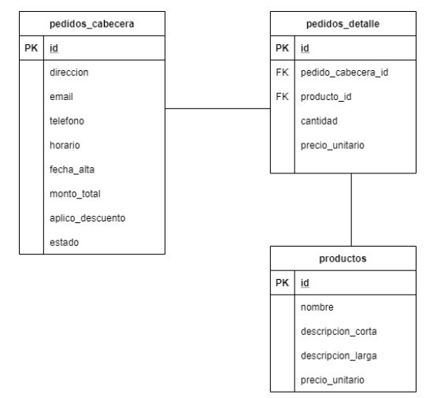

## Introducción 
La tarea consiste en implementar un set de endpoints de una API Rest mediante Spring Boot.

Nuestras expectativas son:
- Valoramos una solución simple y limpia.
- La solución debe funcionar en forma productiva. 
- Se deben implementar los test correspondientes para validar su funcionamiento.
- El ejercicio debe ser resuelto dentro del transcurso de 3 días.

## Instrucciones
Para realizar eficientemente esta tarea le recomendamos seguir los siguientes pasos:

1. Usar una cuenta personal en [Github](https://github.com)
2. Hacer clic en el botón "Use this template" para crear un repositorio en base a esta plantilla
3. Leer atentamente el enunciado y realizar el ejercicio.
4. Validar los test con el comando ```mvn test```
5. Actualizar el repositorio. 
6. Enviar la URL del repositorio por correo electrónico. 
 
## Requisitos
- JDK 8 o superior
- Maven

## Enunciado
Se solicita implementar una API Rest que permita registrar el alta de pedidos de una pizzería.

Se deben modelar las siguientes Entidades:
- Productos
- Pedidos (Cabecera y Detalle)



Se deben implementar los siguientes endpoints:

- CRUD de Productos
- Alta de Pedido
- Consulta de Pedidos del día actual

Se debe implementar la siguiente regla de negocio:

- Si el cliente solicita más de 3 artículos, se le aplica un 30% de descuento.

Las respuestas deben ser en formato JSON.
